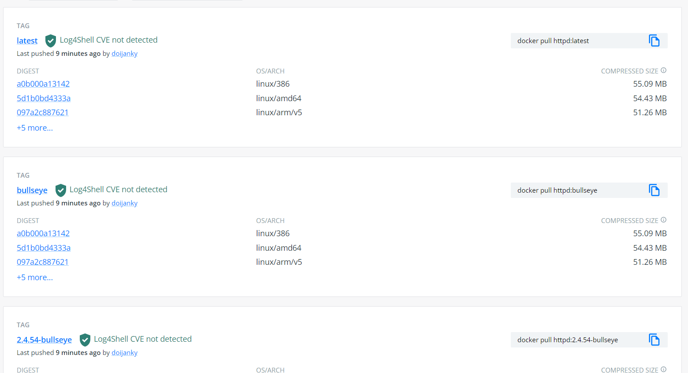
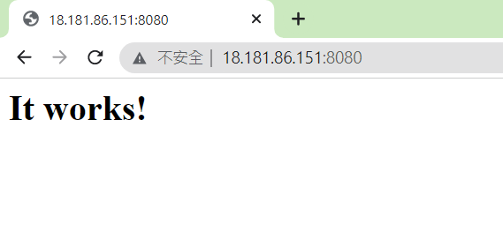

## 鏡像名稱格式

image server/owner/


## docker pull image:[tag]
[Docker http](https://hub.docker.com/_/httpd)
```
[root@docker1 .ssh]# docker pull httpd
Using default tag: latest
latest: Pulling from library/httpd
7a6db449b51b: Pull complete
b4effd428409: Pull complete
6b29c2b62286: Pull complete
c2123effa3fc: Pull complete
152876b0d24a: Pull complete
Digest: sha256:70999c4a17c796dd28f86f9c847b30f28abaed6ef1fd72a44282b1c941238804
Status: Downloaded newer image for httpd:latest
```
根據tag拉取不同系統支援的鏡像，預設latest  


## docker run
`--name my-apache-app`：container name  
`-p 8080:80`：`主機 8080 port`對應`容器 80 port`
`httpd`：image name
```
[root@docker1 centos]# docker run -d --name my-apache-app -p 8080:80 httpd
b54526ef6a1e393643732802c0e1e596b1b56385d3f3ad5e0a4aceb8c705398f
[root@docker1 centos]# docker ps
CONTAINER ID        IMAGE               COMMAND              CREATED              STATUS              PORTS                  NAMES
b54526ef6a1e        httpd               "httpd-foreground"   About a minute ago   Up About a minute   0.0.0.0:8080->80/tcp   my-apache-app
```
`httpd-foreground`：背景執行

  
## docker rmi [IMAGE ID]
輸入id前幾個字母效果跟全id一樣
```
[root@docker1 centos]# docker images
REPOSITORY          TAG                 IMAGE ID            CREATED             SIZE
httpd               latest              a981c8992512        3 weeks ago         145MB
[root@docker1 centos]# docker rmi a98
Untagged: httpd:latest
Untagged: httpd@sha256:c9967857a0cdf1136351ab610add617e28aa2952a9b678b1edb0f1021ea7cfdb
Deleted: sha256:a981c8992512d65c9b450a9ecabb1cb9d35bb6b03f3640f86471032d5800d825
Deleted: sha256:0fbd49f82b45671985b3275bbe52bb36496047a8893146e7e6fc8b258c0c7274
Deleted: sha256:d4d2d5c5d610b9cd6063e316954eb0bdc0af36cf8c94570658278504f4c6bbf8
Deleted: sha256:1c463a675bc2ad1cd823d7944a0c7cbea87635a248257455c5fd355c98bcfd0a
Deleted: sha256:6b66301e945a6b716b5fdef63c4e2e2dd692ec6aa5a84abb1165dec8a22538c6
Deleted: sha256:6485bed636274e42b47028c43ad5f9c036dd7cf2b40194bd556ddad2a98eea63
```
## docker push
```
[root@docker1 centos]# docker push nickkcin/httpd
The push refers to repository [docker.io/nickkcin/httpd]
490318bdc71b: Pushed
01597d537f57: Mounted from library/httpd
c7c38e3c39ad: Mounted from library/httpd
c672c6903747: Mounted from library/httpd
34e2a1369fc5: Mounted from library/httpd
6485bed63627: Mounted from library/httpd
latest: digest: sha256:9ececc77050c5243ea81897eee48421591fa45d75d71fcbee5977b8cc0e15981 size: 1578
```
## docker commit
```
[root@docker1 centos]# docker tag httpd:v1 nickkcin/httpd
[root@docker1 centos]# docker images
REPOSITORY          TAG                 IMAGE ID            CREATED             SIZE
httpd               v1                  63895ef6aa13        25 minutes ago      199MB
nickkcin/httpd      latest              63895ef6aa13        25 minutes ago      199MB
httpd               latest              a981c8992512        3 weeks ago         145MB
```