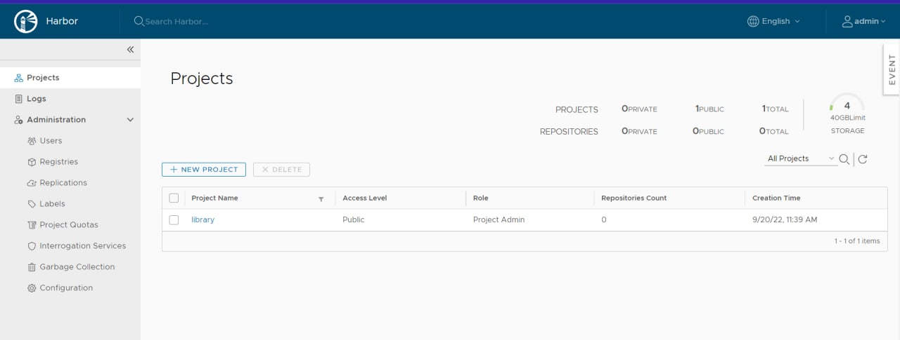

## Docker volumes

確保容器死去時能保存資料
```
[centos@docker1 ~]$ docker volume -h
Flag shorthand -h has been deprecated, please use --help

Usage:  docker volume COMMAND

Manage volumes

Commands:
  create      Create a volume
  inspect     Display detailed information on one or more volumes
  ls          List volumes
  prune       Remove all unused local volumes
  rm          Remove one or more volumes

Run 'docker volume COMMAND --help' for more information on a command.
```
## docker volume create
```
[root@docker1 centos]# docker volume create myvolume1
myvolume1
```
`Mountpoint`：資料存放位置
```
[root@docker1 centos]# docker volume inspect myvolume1
[
    {
        "CreatedAt": "2022-09-20T01:25:51Z",
        "Driver": "local",
        "Labels": {},
        "Mountpoint": "/var/lib/docker/volumes/myvolume1/_data",
        "Name": "myvolume1",
        "Options": {},
        "Scope": "local"
    }
]
```
```
[root@docker1 ~]# cd /var/lib/docker/volumes/myvolume1/
[root@docker1 myvolume1]# ls
_data
```


```
[root@docker1 ~]# docker run -it -v myvol1:/data busybox sh
/ # ll
sh: ll: not found
/ # ls
bin   data  dev   etc   home  proc  root  sys   tmp   usr   var
/ # cd data
/data # ls
/data # echo "Hi" > hi
/data # ls
hi
```

```
[root@docker1 user]# docker run -it -v myvol1:/data busybox sh
/ # ls
bin   data  dev   etc   home  proc  root  sys   tmp   usr   var
/ # cd data
/data # ls
hi
/data # echo "2" > hi2
/data # ls
hi   hi2

```
## server
```
[root@docker1 ~]# docker tag busybox 18.181.86.151:5000/busybox:1.0
[root@docker1 ~]# docker images
REPOSITORY                   TAG                 IMAGE ID            CREATED             SIZE
18.181.86.151:5000/busybox   1.0                 2bd29714875d        6 days ago          1.24MB
18.181.86.151:5000/busybox   latest              2bd29714875d        6 days ago          1.24MB
busybox                      latest              2bd29714875d        6 days ago          1.24MB
httpd                        latest              a981c8992512        3 weeks ago         145MB
registry                     latest              3a0f7b0a13ef        5 weeks ago         24.1MB
[root@docker1 ~]# docker push 18.181.86.151:5000/busybox:1.0
The push refers to repository [18.181.86.151:5000/busybox]
3e9498aeb76f: Pushed
1.0: digest: sha256:bbb248c803ff97f51db3b37a2a604a6270cd2ee1ca9266120aeccb3b19ce80d2 size: 527
```
## client
```
[root@docker1 centos]# cat /etc/docker/daemon.json
{
    "insecure-registries":["172.31.4.152"]
}
[root@docker1 centos]# systemctl daemon-reload
[root@docker1 centos]# systemctl restart docker
```
```
[root@docker1 centos]# docker push 172.31.4.152:5000/busybox:1.0
The push refers to repository [172.31.4.152:5000/busybox]
3e9498aeb76f: Pushed
1.0: digest: sha256:bbb248c803ff97f51db3b37a2a604a6270cd2ee1ca9266120aeccb3b19ce80d2 size: 527
```
```
[root@docker1 centos]# docker pull 172.31.4.152:5000/busybox:1.0
1.0: Pulling from busybox
Digest: sha256:bbb248c803ff97f51db3b37a2a604a6270cd2ee1ca9266120aeccb3b19ce80d2
Status: Downloaded newer image for 172.31.4.152:5000/busybox:1.0
[root@docker1 centos]# docker images
REPOSITORY                       TAG                 IMAGE ID            CREATED             SIZE
172.31.4.152/myproject/busybox   2.0                 2bd29714875d        13 days ago         1.24MB
172.31.4.152:5000/busybox        1.0                 2bd29714875d        13 days ago         1.24MB
busybox                          latest              2bd29714875d        13 days ago         1.24MB
httpd                            latest              f2789344c573        2 weeks ago  
```

## docker harbor
[參考網站](https://medium.com/starbugs/%E7%94%A8-harbor-%E6%9E%B6%E8%A8%AD%E7%A7%81%E6%9C%89-docker-%E5%80%89%E5%BA%AB-9e7eb2bbf769)
### 下載安裝檔
```
wget https://github.com/goharbor/harbor/releases/download/v1.10.0/harbor-online-installer-v1.10.0.tgz
```
### 解壓縮
```
tar xvf harbor-online-installer-v1.10.0.tgz
```
### 進行安裝
把`https`的部分註解掉，修改`hostman`  
`harbor_admin_password`密碼也可以修改，看個人  
執行`install.h`  
```
vi harbor.yml
./install.sh
```

### harbor首頁
完成後訪問ip  
