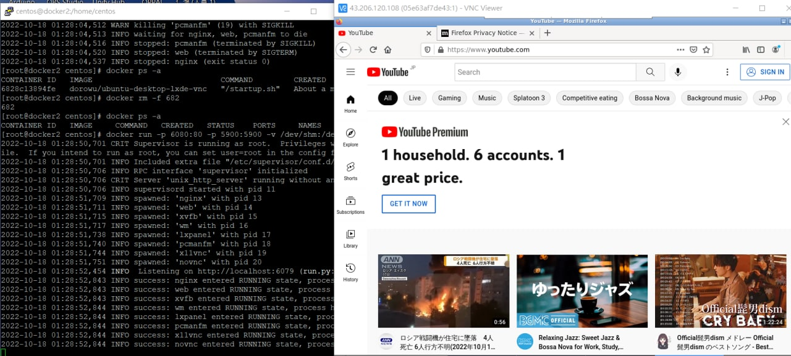
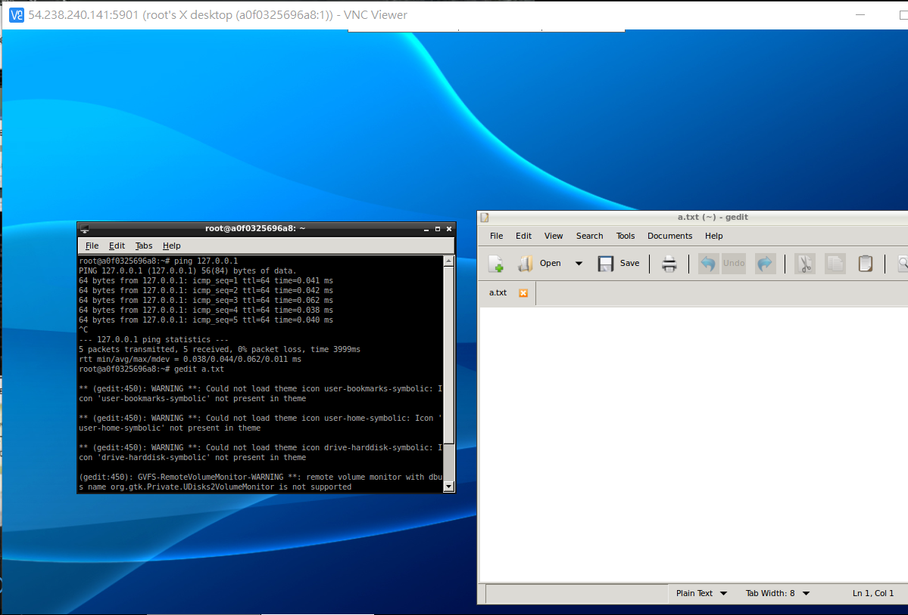

## docker圖形化

```
docker run -it --rm -p 5901:5901 -e USER=root myvnc:1.0 bash -c "vncserver :1 -geetry 1280x800 -depth 24 && tail -F /root/.vnc/*.log"
```
  

## 自創圖形化界面的docker
```
mkdir test_vnc
vi Dockerfile
```
## Dockerfile
```
FROM ubuntu:14.04
MAINTAINER bowwow <bowwow@gmail.com>

ENV DEBIAN_FRONTEND noninteractive
ENV HOME /root

RUN sed -i 's/# \(.*multiverse$\)/\1/g' /etc/apt/sources.list

RUN \
  apt-get update && \
  apt-get install -y build-essential && \
  apt-get install -y software-properties-common && \
  apt-get install -y byobu curl git htop man unzip vim wget gedit iputils-ping&& \
  apt-get install -y xorg lxde-core lxterminal tightvncserver && \
  rm -rf /var/lib/apt/lists/*

EXPOSE 5901
WORKDIR /root

CMD ["bash"]
```
```
[root@docker1 test_vnc_docker]# docker run -it --rm -p 5901:5901 -e USER=root myvnc:1.0 bash -c "vncserver :1 -geometry 1280x800 -depth 24 && tail -F /root/.vnc/*.log"

You will require a password to access your desktops.

Password:
Verify:
Would you like to enter a view-only password (y/n)? n
```
確認有安裝`ping`、`gedit`工具  

## python flask
[參考網站](https://wulc.me/2019/04/19/%E9%80%9A%E8%BF%87%20Flask,%20Docker,%20Jenkins%20%E5%92%8C%20Kubernets%20%E9%83%A8%E7%BD%B2%E6%9C%BA%E5%99%A8%E5%AD%A6%E4%B9%A0%E6%A8%A1%E5%9E%8B/)
安裝`pip`、`sklearn`  
```
wget  https://bootstrap.pypa.io/pip/2.7/get-pip.py
python get-pip.py
pip install sklearn
pip install -U scikit-learn
```
訓練模型  
```
[root@docker1 test_iris]# python 1.py
finished training and dump the model as model.pkl
[root@docker1 test_iris]# ls
1.py  get-pip.py  model.pkl
```
```
pip install flask
```
```
[root@docker1 test_iris]# python server.py
 * Serving Flask app "server" (lazy loading)
 * Environment: production
   WARNING: This is a development server. Do not use it in a production deployment.
   Use a production WSGI server instead.
 * Debug mode: on
 * Running on http://0.0.0.0:5000/ (Press CTRL+C to quit)
 * Restarting with stat
 * Debugger is active!
 * Debugger PIN: 112-904-812
```
url要改成`server ip`
```
vi client.py 


# coding: utf-8
import requests
# Change the value of experience that you want to test
url = 'http://172.31.15.213:5000/api'
feature = [[5.8, 4.0, 1.2, 0.2]]
labels ={
  0: "setosa",
  1: "versicolor",
  2: "virginica"
}

r = requests.post(url,json={'feature': feature})
print(labels[r.json()])
```
```
[root@docker2 ~]# python client.py
setosa
```

## 打包flask成docker
```
vi Dockerfile
# train and run the model with RESTful api
FROM nitincypher/docker-ubuntu-python-pip

COPY ./requirements.txt /app/requirements.txt

WORKDIR /app

RUN pip install -r requirements.txt

COPY . /app

CMD python /app/1.py && python /app/server.p
```
`requirements.txt`：需要的套件  
```
vi requirements.txt

sklearn
scikit-learn
flask
```
```
[root@docker1 test_iris]# docker build -t myiris:1.0 .
Sending build context to Docker daemon  4.097MB
Step 1/6 : FROM nitincypher/docker-ubuntu-python-pip
 ---> a6659c7f1508
Step 2/6 : COPY ./requirements.txt /app/requirements.txt
 ---> Using cache
 ---> 5ff7448f8e40
Step 3/6 : WORKDIR /app
 ---> Using cache
 ---> 2c96337ea507
Step 4/6 : RUN pip install -r requirements.txt
 ---> Using cache
 ---> 747c4c2d89d2
Step 5/6 : COPY . /app
 ---> Using cache
 ---> 0e9fde8c87be
Step 6/6 : CMD python /app/1.py && python /app/server.py
 ---> Using cache
 ---> b1dfd65f3e45
Successfully built b1dfd65f3e45
Successfully tagged myiris:1.0
```
```
[root@docker1 test_iris]# docker ps
CONTAINER ID        IMAGE                  COMMAND                  CREATED              STATUS              PORTS                    NAMES
7111dce086bf        myiris:1.0             "/bin/sh -c 'python …"   About a minute ago   Up About a minute   0.0.0.0:5000->5000/tcp   iris
```
客戶端執行  
```
[root@docker2 ~]# python client.py
setosa
```