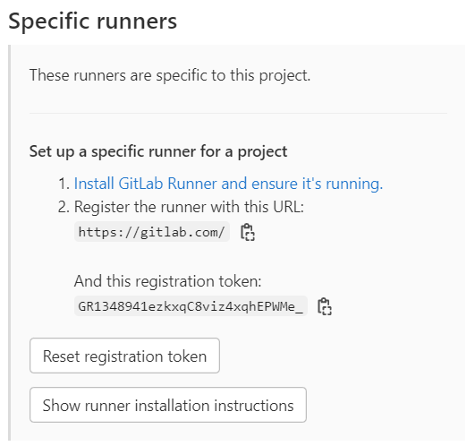

## git lab CI/CD
## docker2
```
[root@docker2 test_irys]# git init
Initialized empty Git repository in /root/test_irys/.git/
[root@docker2 test_irys]# git remote add origin git@gitlab.com:07Nick-kciN21/myiris.git
[root@docker2 test_irys]# git add .
[root@docker2 test_irys]# git commit -m "Initial commit"
[master (root-commit) f1c47d3] Initial commit
 6 files changed, 78 insertions(+)
 create mode 100644 Dockerfile
 create mode 100644 client.py
 create mode 100644 model.pkl
 create mode 100644 requirements.txt
 create mode 100644 server.py
 create mode 100644 train_model.py
[root@docker2 test_irys]# git push -u origin master
Counting objects: 8, done.
Delta compression using up to 2 threads.
Compressing objects: 100% (7/7), done.
Writing objects: 100% (8/8), 2.45 KiB | 0 bytes/s, done.
Total 8 (delta 0), reused 0 (delta 0)
remote:
remote: To create a merge request for master, visit:
remote:   https://gitlab.com/07Nick-kciN21/myiris/-/merge_requests/new?merge_request%5Bsource_b                                                                                              ranch%5D=master
remote:
To git@gitlab.com:07Nick-kciN21/myiris.git
 * [new branch]      master -> master
Branch master set up to track remote branch master from origin.
```
## docker3 

```
[root@docker3 ~]# gitlab-runner register
Runtime platform                                    arch=amd64 os=linux pid=14390 revision=0d4137b8 version=15.5.0
Running in system-mode.

Enter the GitLab instance URL (for example, https://gitlab.com/):
https://gitlab.com/

Enter the registration token:
GR1348941ezkxqC8viz4xqhEPWMe_
Enter a description for the runner:
[docker3]:
Enter tags for the runner (comma-separated):
docker3
Enter optional maintenance note for the runner:

Registering runner... succeeded                     runner=GR1348941ezkxqC8v

Enter an executor: docker, shell, instance, virtualbox, docker+machine, docker-ssh+machine, kubernetes, custom, docker-ssh, parallels, ssh:
shell
Runner registered successfully. Feel free to start it, but if it's running already the config should be automatically reloaded!

Configuration (with the authentication token) was saved in "/etc/gitlab-runner/config.toml"
```