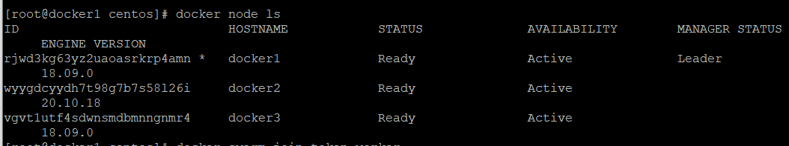
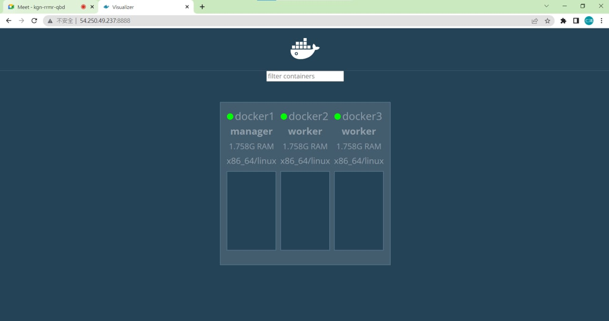
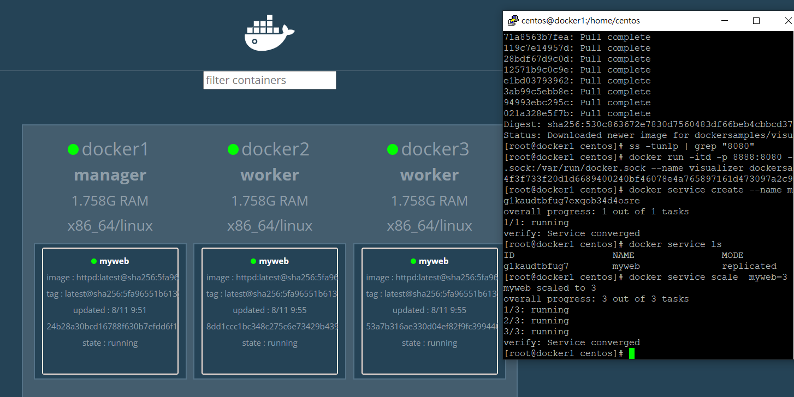
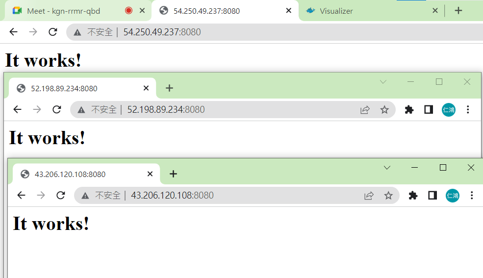

## 參考資料
[雲端通訊整合實務第九周11/30](https://hackmd.io/@OgGHGgaiTS-n40lMrpE3Tg/BJFXcu6zK/%2FI8qCG4R4R5W7J62DIBr7JQ)
## docker swarm
```
[root@docker1 centos]# docker swarm init --advertise-addr 172.31.15.213
Swarm initialized: current node (rjwd3kg63yz2uaoasrkrp4amn) is now a manager.

To add a worker to this swarm, run the following command:

    docker swarm join --token SWMTKN-1-4ts93xzrmromkfxs8027kpivpugp44i1hrif5bbfw868rr71l7-7s11vhctq7cr046x2ljp3i09i 172.31.15.213:2377

To add a manager to this swarm, run 'docker swarm join-token manager' and follow the instructions.
```
```
[root@docker1 centos]# docker swarm join-token worker
To add a worker to this swarm, run the following command:

    docker swarm join --token SWMTKN-1-4ts93xzrmromkfxs8027kpivpugp44i1hrif5bbfw868rr71l7-7s11vhctq7cr046x2ljp3i09i 172.31.15.213:2377
```
```
[root@docker3 centos]# docker swarm join --token SWMTKN-1-4ts93xzrmromkfxs8027kpivpugp44i1hrif5bbfw868rr71l7-7s11vhctq7cr046x2ljp3i09i 172.31.15.213:2377
This node joined a swarm as a worker.
```
```
[root@docker2 centos]# docker swarm join --token SWMTKN-1-4ts93xzrmromkfxs8027kpivpugp44i1hrif5bbfw868rr71l7-7s11vhctq7cr046x2ljp3i09i 172.31.15.213:2377
This node joined a swarm as a worker.
```


## docker visualizer
```
[root@docker1 centos]# docker pull dockersamples/visualizer
Using default tag: latest
latest: Pulling from dockersamples/visualizer
ddad3d7c1e96: Pull complete
3a8370f05d5d: Pull complete
71a8563b7fea: Pull complete
119c7e14957d: Pull complete
28bdf67d9c0d: Pull complete
12571b9c0c9e: Pull complete
e1bd03793962: Pull complete
3ab99c5ebb8e: Pull complete
94993ebc295c: Pull complete
021a328e5f7b: Pull complete
Digest: sha256:530c863672e7830d7560483df66beb4cbbcd375a9f3ec174ff5376616686a619
Status: Downloaded newer image for dockersamples/visualizer:latest
```
```
[root@docker1 centos]# docker run -itd -p 8888:8080 -e HOST=172.31.15.213 -e PORT=8080 -v /var/run/docker.sock:/var/run/docker.sock --name visualizer dockersamples/visualizer
4f3f733f20d1d6689400240bf46078e4a765897161d473097a2c90bd7669a96f
```

## service create
```
[root@docker1 centos]# docker service create --name myweb httpd
g1kaudtbfug7exqob34d4osre
overall progress: 1 out of 1 tasks
1/1: running
verify: Service converged
[root@docker1 centos]# docker service ls
ID                  NAME                MODE                REPLICAS            IMAGE               PORTS
g1kaudtbfug7        myweb               replicated          1/1                 httpd:latest
```

## service scale
```
[root@docker1 centos]# docker service scale  myweb=3
myweb scaled to 3
overall progress: 3 out of 3 tasks
1/3: running
2/3: running
3/3: running
verify: Service converged
```



## node update --availability drain
drain：不會被分配工作，原本在節點上的會被轉移
```
[root@docker1 centos]# docker node update --availability drain docker1
docker1
[root@docker1 centos]# docker node ls
ID                            HOSTNAME            STATUS              AVAILABILITY         MANAGER STATUS      ENGINE VERSION
rjwd3kg63yz2uaoasrkrp4amn *   docker1             Ready               Drain                Leader              18.09.0
wyygdcyydh7t98g7b7s58l26i     docker2             Ready               Active                                   20.10.18
vgvt1utf4sdwnsmdbmnngnmr4     docker3             Ready               Active                                   18.09.0
```

## 附載均衡
docker swam有內建附載均衡

```
[root@docker1 ~]# docker exec -it 636 bash
root@636cfb3acd83:/usr/local/apache2# echo "h1" > htdocs/hi.htm
root@636cfb3acd83:/usr/local/apache2# exit
```
```
[root@docker2 centos]# docker exec -it 430 bash
root@430752402e4c:/usr/local/apache2# echo "h2" > htdocs/hi.htm
root@430752402e4c:/usr/local/apache2# exit
```
```
[root@docker3 centos]# docker exec -it 1b3 bash
root@1b3a6997aaf0:/usr/local/apache2# echo "h3" > hi.htm
root@1b3a6997aaf0:/usr/local/apache2# exit
```
```
[root@docker1 ~]# for i in `seq 10`; do curl http://54.250.49.237:8080/hi.htm; done
h1
h2
h3
h1
h2
h3
h1
h2
h3
h1
```
## ervice update --publish-add
```
[root@docker1 centos]# docker service update --publish-add 8080:80 myweb
myweb
overall progress: 1 out of 1 tasks
1/1: running
verify: Service converged
```
```
[root@ip-172-31-42-235 ~]# cat /etc/haproxy/haproxy.cfg
global
  daemon
  chroot /var/lib/haproxy
  user haproxy
  group haproxy
  stats timeout 30s

defaults
  mode http
  log global
  option httplog
  option dontlognull
  timeout connect 5000
  timeout client 50000
  timeout server 50000

frontend http_front
  bind *:80
  stats uri /haproxy?stats
  default_backend http_back

backend http_back
  balance roundrobin
  server docker1 172.31.15.213:8080 check
  server docker2 172.31.4.152:8080 check
  server docker3 172.31.4.199:8080 check
```
```
[root@ip-172-31-42-235 centos]# systemctl start haproxy
```

## docker rm node
1. 停止節點活動
```
[root@docker1 centos]# docker node update --availability drain docker2
docker2
[root@docker1 centos]# docker node update --availability drain docker3
docker3
```

2. 節點移除swarm
```
[root@docker2 centos]# docker swarm leave
Node left the swarm.
```
```
[root@docker3 centos]# docker swarm leave
Node left the swarm.
```
3. 移除節點
```
[root@docker1 centos]# docker node rm docker2
docker2
[root@docker1 centos]# docker node rm docker3
docker3
```