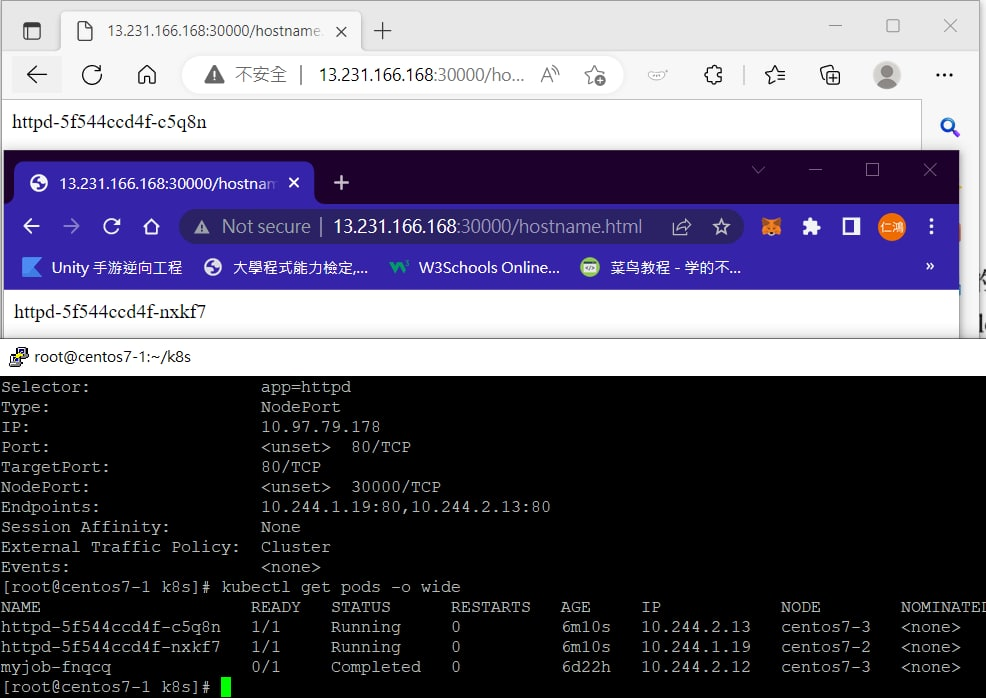

```
[root@centos7-1 test_wangyanglinux]# docker pull wangyanglinux/myapp:v1
[root@centos7-1 test_wangyanglinux]# docker pull wangyanglinux/myapp:v2
```
```
[root@centos7-1 k8s]# cp httpd.v1.yml test_wangyanglinux/
[root@centos7-1 k8s]# cp nginx-svc.yml test_wangyanglinux/
[root@centos7-1 k8s]# cd test_wangyanglinux/
[root@centos7-1 test_wangyanglinux]# ls
httpd.v1.yml  nginx-svc.yml
```
```
[root@centos7-1 test_wangyanglinux]# cat httpd.v1.yml
apiVersion: apps/v1
kind: Deployment
metadata:
  name: httpd
spec:
  selector:
    matchLabels:
      app: httpd
  revisionHistoryLimit: 10
  replicas: 2
  template:
    metadata:
      labels:
        app: httpd
    spec:
      containers:
      - name: httpd
        image: wangyanglinux/myapp:v1
        ports:
        - containerPort: 80
```

```
[root@centos7-1 test_wangyanglinux]# cat nginx-svc.yml
apiVersion: v1
kind: Service
metadata:
  name: httpd-svc
spec:
  type: NodePort
  selector:
    app: httpd
  ports:
  - protocol: TCP
    port: 80
    targetPort: 80
    nodePort: 30000
```
```
[root@centos7-1 test_wangyanglinux]# kubectl apply -f httpd.v1.yml
deployment.apps/httpd created
[root@centos7-1 test_wangyanglinux]# kubectl apply -f nginx-svc.yml
service/httpd-svc created
```
```
[root@centos7-1 test_wangyanglinux]# kubectl get deployment
NAME               READY   UP-TO-DATE   AVAILABLE   AGE
httpd              2/2     2            2           63s
nginx-deployment   3/3     3            3           18m
[root@centos7-1 test_wangyanglinux]# kubectl get svc
NAME         TYPE        CLUSTER-IP      EXTERNAL-IP   PORT(S)        AGE
httpd-svc    NodePort    10.104.25.186   <none>        80:30000/TCP   40s
kubernetes   ClusterIP   10.96.0.1       <none>        443/TCP        17s
```
```
[root@centos7-1 test_wangyanglinux]# curl 192.168.153.150:30000
Hello MyApp | Version: v1 | <a href="hostname.html">Pod Name</a>
[root@centos7-1 test_wangyanglinux]# curl 192.168.153.150:30000/hostname.html
httpd-5f544ccd4f-d7ms6
```



## ingress七層負載均衡

```
[root@centos7-1 test-ingress-nginx]# cat service-nodeport.yaml
apiVersion: v1
kind: Service
metadata:
  name: ingress-nginx
  namespace: ingress-nginx
  labels:
    app.kubernetes.io/name: ingress-nginx
    app.kubernetes.io/part-of: ingress-nginx
spec:
  type: NodePort
  ports:
    - name: http
      port: 80
      nodePort: 31080
      targetPort: 80
      protocol: TCP
    - name: https
      port: 443
      targetPort: 443
      protocol: TCP
  selector:
    app.kubernetes.io/name: ingress-nginx
    app.kubernetes.io/part-of: ingress-nginx
---
```
`httpd`跟`myweb`分別改為`httpd:wangyanglinux/myapp:v1`、`httpd:wangyanglinux/myapp:v2`  
```
[root@centos7-1 test-ingress-nginx]# cat httpd.yaml
apiVersion: apps/v1
kind: Deployment
metadata:
  name: httpd
  labels:
    app: httpd
spec:
  selector:
    matchLabels:
      app: httpd
  replicas: 2
  template:
    metadata:
      labels:
        app: httpd
    spec:
      containers:
      - name: httpd
        image: httpd:wangyanglinux/myapp:v2
        ports:
        - containerPort: 80
---
apiVersion: v1
kind: Service
metadata:
  name: httpd
spec:
  selector:
    app: httpd
  ports:
    - protocol: TCP
      port: 80
      targetPort: 80
```

```
[root@centos7-1 test-ingress-nginx]# cat myweb.yaml
apiVersion: apps/v1
kind: Deployment
metadata:
  name: myweb
  labels:
    app: myweb
spec:
  selector:
    matchLabels:
      app: myweb
  replicas: 2
  template:
    metadata:
      labels:
        app: myweb
    spec:
      containers:
      - name: myweb
        image: wangyanglinux/myapp:v1
        ports:
        - containerPort: 80
---
apiVersion: v1
kind: Service
metadata:
  name: myweb
spec:
  selector:
    app: myweb
  ports:
    - protocol: TCP
      port: 80
      targetPort: 80
```
```
[root@centos7-1 test-ingress-nginx]# kubectl apply -f httpd.yaml

[root@centos7-1 test-ingress-nginx]# kubectl apply -f myweb.yaml

[root@centos7-1 test-ingress-nginx]# kubectl apply -f mandatory.yaml

[root@centos7-1 test-ingress-nginx]# kubectl apply -f service-nodeport.yaml

[root@centos7-1 test-ingress-nginx]# kubectl apply -f ingress-httpd.yam
```
在`C:\Windows\System32\drivers\etc\hosts`寫入ip跟domain  
```
13.231.166.168 www.a.com
13.231.166.168 www.b.com
```

## 永久化儲存

## NFS
```
yum install nfs-utils
systemctl restart rpcbind
systemctl restart nfs
```

```
vi /etc/exports
```
```
[root@centos7-1 ~]# showmount -e localhost
Export list for localhost:
/data/ 192.168.0.0/24
```
## PV
```
[root@centos7-1 k8s]# vi pv.yaml
apiVersion: v1
kind: PersistentVolume
metadata:
  name: my-pv
spec:
  capacity:
    storage: 5Gi
  accessModes:
    - ReadWriteMany
  nfs:
    path: /data-nfs
    server: 192.168.153.150
```
```
[root@centos7-1 k8s]# kubectl apply -f pv.yaml
persistentvolume/my-pv created
[root@centos7-1 k8s]# kubectl get pv
NAME    CAPACITY   ACCESS MODES   RECLAIM POLICY   STATUS      CLAIM   STORAGECLASS   REASON   AGE
my-pv   5Gi        RWX            Retain           Available                                   6s
```
## PVC
```
[root@centos7-1 k8s]# kubectl apply -f pvc.yaml
deployment.apps/httpd-dep2 created
NAME     STATUS   VOLUME   CAPACITY   ACCESS MODES   STORAGECLASS   AGE
my-pvc   Bound    my-pv    5Gi        RWX                           8m17s
[root@centos7-1 k8s]# kubectl get pv
NAME    CAPACITY   ACCESS MODES   RECLAIM POLICY   STATUS   CLAIM            STORAGECLASS   REASON   AGE
my-pv   5Gi        RWX            Retain           Bound    default/my-pvc                           12m
```